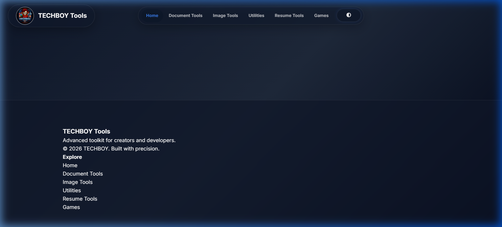
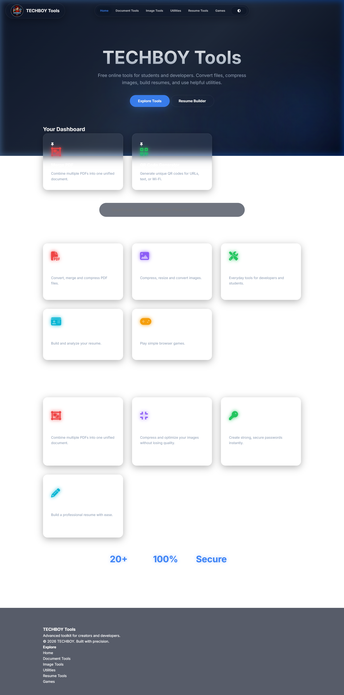
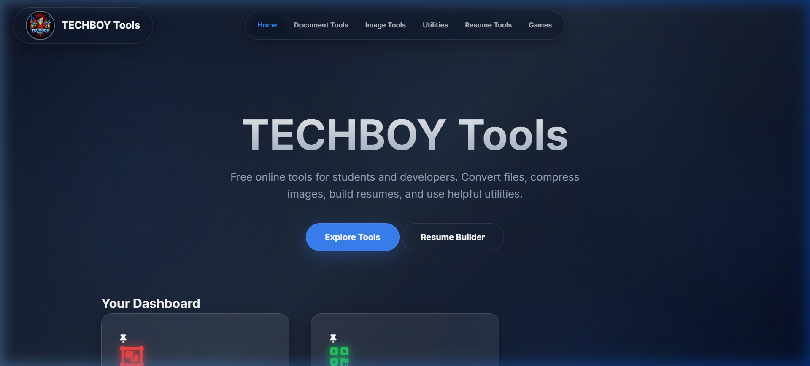

<div align="center">

<br>


<br><br>

# TECHBOY Tools

**The Ultimate Free Maker Dashboard — Built for Creators, Developers & Students**

<br>

[](https://chimataraghuram.github.io/TECHBOY-TOOLS/)
&nbsp;
[](https://github.com/chimataraghuram/TECHBOY-TOOLS/stargazers)
&nbsp;
[](https://chimataraghuram.github.io/TECHBOY-TOOLS/)
&nbsp;
[](LICENSE)

<br>

> **20+ powerful tools.** All 100% free. No sign-up. No uploads. Everything runs in your browser.

<br>

</div>

---

## 🖼️ Preview

<div align="center">



*The Aurora Dark dashboard — Premium glassmorphism design with live statistics*

| Tools Page | Navbar & Branding |
|:---:|:---:|
|  |  |

</div>

---

## ✨ What's Inside

<table>
<tr>
<td width="50%">

### 📄 Document Tools
- 📦 Merge PDF — combine multiple files
- ✂️ Split PDF — extract specific pages
- 🗜️ Compress PDF — reduce file size
- 🔄 Word ↔ PDF — convert both ways
- 🖼️ Bulk PDF to Image — extract all pages

</td>
<td width="50%">

### 🖼️ Image Tools
- 🗜️ Image Compressor
- 📐 Resize Image (custom px)
- 🔄 JPG ↔ PNG Converter
- ⚡ Batch Image Processor
- 🔍 **Extract Text (OCR)** — AI-powered
- 🪄 **Remove Background** — AI on-device

</td>
</tr>
<tr>
<td>

### 🛠️ Utilities
- 🔐 Password Generator & Strength Checker
- 📊 QR Code Generator
- 🎨 Color Palette Generator
- 📝 Markdown Editor (live preview)
- 🔢 Word Counter
- 📐 Unit Converter (PX, REM...)
- 💻 **Code Sandbox** — Live HTML/CSS/JS
- 🤖 AI Technical Writer
- 📦 Code Snippet Vault

</td>
<td>

### 📝 Resume Tools + 🎮 Games
- 📋 Resume Builder (PDF export)
- 🔍 ATS Analyzer (score + feedback)
- ✨ AI Resume Improver
- 🐍 Snake Game
- 🟦 Same Game (click groups)

</td>
</tr>
</table>

---

## 🚀 Highlights

| Feature | Detail |
|---|---|
| 🔒 **100% Private** | No files ever leave your device. All processing is client-side JavaScript |
| ⚡ **Instant Load** | No backend, no server. Opens in seconds from any browser |
| 📱 **Installable PWA** | Add to home screen on Android/iOS/Desktop for an app-like experience |
| 🧠 **AI-Powered** | OCR via Tesseract.js, Background removal via `@imgly/background-removal` |
| 🎨 **Aurora Dark UI** | Premium glassmorphism design with Space Grotesk typography |
| 📌 **Personalized Dashboard** | Pin your favourite tools, track recently used, see your impact counter |
| 🔍 **Smart Search** | Instantly find any tool by name or keyword |
| ♿ **Accessible** | Keyboard-navigable with semantic HTML |

---

## 🧰 Tech Stack

| Layer | Technologies |
|---|---|
| **Core** | HTML5, CSS3 (Custom Properties), Vanilla JS (ES2022) |
| **Fonts** | [Inter](https://fonts.google.com/specimen/Inter) + [Space Grotesk](https://fonts.google.com/specimen/Space+Grotesk) |
| **Icons** | Font Awesome 6 |
| **PDF** | [pdf-lib](https://pdf-lib.js.org/), [PDF.js](https://mozilla.github.io/pdf.js/), [jsPDF](https://parall.ax/products/jspdf) |
| **Documents** | [mammoth.js](https://github.com/mwilliamson/mammoth.js), [docx.js](https://docx.js.org/) |
| **Images** | HTML5 Canvas API, [html2canvas](https://html2canvas.hertzen.com/) |
| **OCR** | [Tesseract.js v5](https://tesseract.projectnaptha.com/) |
| **AI Bg Remove** | [@imgly/background-removal](https://github.com/imgly/background-removal-js) |
| **Utilities** | [QRCodeJS](https://github.com/davidshimjs/qrcodejs), [JSZip](https://stuk.github.io/jszip/) |
| **PWA** | Service Worker + Web App Manifest |
| **Storage** | `localStorage` — no accounts needed |
| **Hosting** | GitHub Pages |

---

## 📦 Project Structure

```
TECHBOY-TOOLS/
├── index.html          # Single-page app entry
├── manifest.json       # PWA manifest
├── sw.js               # Service worker (offline caching)
│
├── css/
│   └── styles.css      # Aurora Dark design system
│
├── js/
│   └── app.js          # All routing, views & tool logic (~2000 lines)
│
├── assets/
│   └── logo_main.jpg
│
└── screenshots/        # Site preview images
```

---

## 📲 Install as App (PWA)

TECHBOY Tools is a **Progressive Web App** — install it for a native app experience:

1. Open **[chimataraghuram.github.io/TECHBOY-TOOLS](https://chimataraghuram.github.io/TECHBOY-TOOLS/)** in Chrome
2. Click the **install icon** in the address bar (desktop) or **"Add to Home Screen"** (mobile)
3. Done — it works offline too! ✅

---

## 🤝 Contributing

Contributions, issues, and feature requests are welcome!

1. Fork the repository
2. Create your branch: `git checkout -b feature/my-new-tool`
3. Commit your changes: `git commit -m 'feat: Add my new tool'`
4. Push: `git push origin feature/my-new-tool`
5. Open a Pull Request

---

<div align="center">

**[⭐ Star this repo](https://github.com/chimataraghuram/TECHBOY-TOOLS) if you find it useful!**

<br>

Made with ❤️ by **TECHBOY** &nbsp;•&nbsp; MIT License &nbsp;•&nbsp; © 2026

</div>
